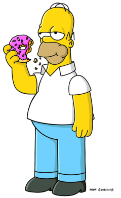
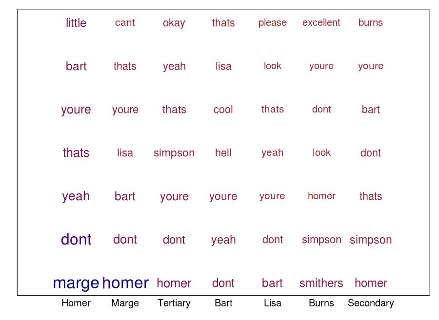
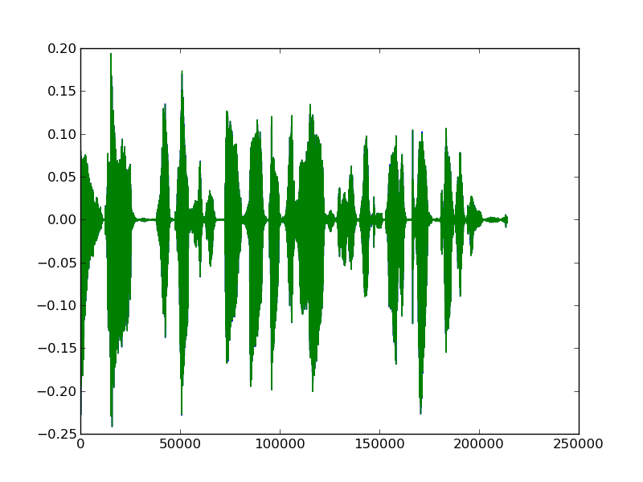
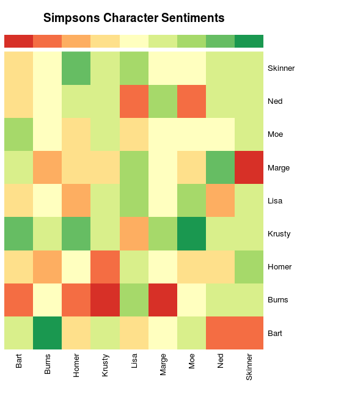

# How much do characters on the Simpsons like each other?
## Vik Paruchuri
## Equirio

---
= data-x="0" data-y="0" data-scale="2"

## Before we start

* Follow along at vikparuchuri.github.io/ignite
* The blog posts this presentation is based on are at www.vikparuchuri.com

### Who am I?
* Founder at Equirio
* [LinkedIn](linkedin.com/in/vikparuchuri)

---
= data-x="1000" data-y="1000" data-scale="2"

## The Crazy Question

### So I was sitting around bored one day....
<br/>




### Do they even like each other?

---
= data-x="2000" data-y="2000" data-scale="1"

## Option 1:  Work with transcripts

### Sadly, there aren't any with speakers labelled.
<br/>

```
I think the boy's hurt.
Just give him a nickel and let's get going!
I think we should call an ambulance, sir.
Hey, cool.
```

<br/>
### So, we should just go through all the episodes and write down who is speaking each line, right?  Right?
<br/>
### Nah.  Don't worry, head.  The computer will do our thinking now.

---
= data-x="3000" data-y="0" data-scale="1"

## But training data is cool too, right?

### Hand-label some lines as training data.
<br/>


---
= data-x="4000" data-y="1000" data-scale="1"

## Commonly said words



---
= data-x="5000" data-y="2000" data-scale="2"

## Computer stuff
* Use natural language processing and machine learning to predict who is speaking unlabelled lines.

### Phew, all this computer hacking is making me thirsty, I think I'll order a tab.

---
= data-x="6000" data-y="0" data-scale="2"

## So, the accuracy kind of sucks

### Good

```
Bart :  Dad, how would you like to be sold to an ivory dealer?
Bart :  Dad, you're sinking!  Huh?
Marge :  Get a rope, Bart.  No, that's okay.
```

<br/>
### Bad

```
Marge :  Hey, it's morning, and Mom and Dad aren't home yet.
Tertiary :  Hey. This isn't the Y.M.C.A.
Homer :  Dispatch, this is Chief Wiggum back in pursuit of the rebelling women.
```

<br/>
### Kids, you tried your best and you failed miserably. The lesson is, never try.

---
= data-x="7000" data-y="1000" data-scale="1"

## But wait, there's more!

### We have been ignoring the information available via audio.
<br/>




---
= data-x="8000" data-y="2000" data-scale="1"

## Subtitles + Audio = Happiness

### Strip audio tracks from videos.
### Get subtitle files and sync them to audio.
<br/>

```
282
00:17:32,523 --> 00:17:35,651
I am so Krunchy the Clown!
[ Belches ]

283
00:17:35,760 --> 00:17:37,955
All right. That's it.
```

---
= data-x="9000" data-y="2000" data-scale="2"

## Find audio "fingerprint" for each character

### Use features like zero crossing rate, MFCC, etc with our hand labelled lines.

---
= data-x="10000" data-y="0" data-scale="1"

## Visualizing fingerprints in 2D


---
= data-x="11000" data-y="1000" data-scale="1"

## Figure out the scene

* Take each character, and figure out who is in the scene with them.
* Use labelled transcripts for this.

---
= data-x="12000" data-y="2000" data-scale="1"

## Sentiment analysis

* Do sentiment analysis on character dialogue to figure out if they like the people in the scene.
* Use random indexing and cosine similarity.

---
= data-x="13000" data-y="0" data-scale="2"

## And on to the charts



---
= data-x="14000" data-y="0" data-scale="2"

## Burns


---
= data-x="15000" data-y="0" data-scale="2"

## Bart


---
= data-x="16000" data-y="0" data-scale="1"

## Ways to do this better
* It would be good to try to directly infer emotion/sentiment from audio.
* Better ways to determine "in scene characters".
* Incorporate information from the video.

---
= data-x="17000" data-y="0" data-scale="1"

## Conclusions

* Analyzing audio is fun.
* Error rate estimation is tricky (see vikparuchuri.com for details)
* Maximize the information that you have -- it's not always about the algorithm you use.

---
= data-x="18000" data-y="0" data-scale="2"

## Where to learn more

* More information is on www.vikparuchuri.com
* Code is at github.com/vikparuchuri/simpsons-scripts
* Presentation is at vikparuchuri.github.io/ignite

### Thanks for listening!